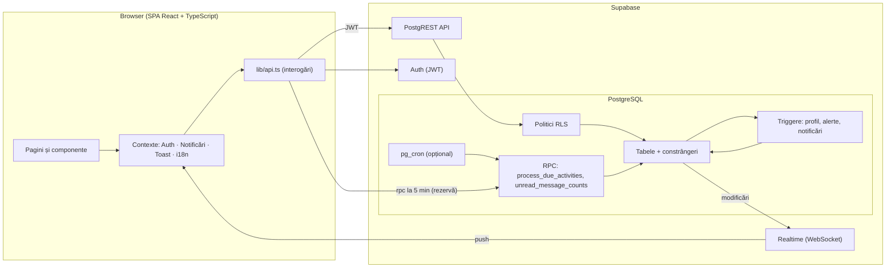
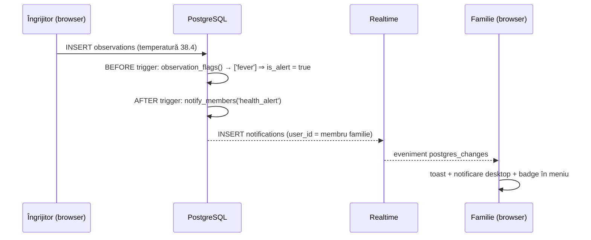

# 2. Cerințe și arhitectura sistemului

## 2.1 Actori și roluri

| Rol | Descriere | Obținere |
|---|---|---|
| **Administrator** | Gestionează conturile, rolurile, persoanele asistate și echipele de îngrijire. Are acces la toate datele. | Primul cont creat; ulterior acordat de un administrator. |
| **Îngrijitor** | Planifică și realizează activitățile, consemnează observații, comunică cu familia. | Ales la înregistrare; acces la date după adăugarea într-o echipă. |
| **Membru al familiei** | Urmărește planul și starea persoanei, primește notificări, comunică cu îngrijitorii, poate adăuga observații și evenimente (ex. o vizită). | Ales la înregistrare (implicit); acces după adăugarea într-o echipă. |

## 2.2 Cerințe funcționale

| ID | Cerință | Implementare |
|---|---|---|
| CF-01 | Înregistrare, autentificare, deconectare, schimbare parolă | Supabase Auth, `AuthPages.tsx`, `Profile.tsx` |
| CF-02 | Rol per utilizator; doar administratorul schimbă roluri și dezactivează conturi | coloana `profiles.role`, trigger `protect_profile_fields`, `Admin.tsx` |
| CF-03 | Evidența persoanelor asistate (date personale, profil medical, contact de urgență) | tabel `elders`, `Elders.tsx`, `ElderDetail.tsx` |
| CF-04 | Echipe de îngrijire: acces doar la persoanele din echipă | tabel `elder_members`, funcția `has_elder_access` + RLS |
| CF-05 | Planificarea activităților (categorie, oră, durată, responsabil, recurență) | tabel `care_activities`, `ActivityFormModal`, `lib/recurrence.ts` |
| CF-06 | Monitorizarea zilei: stare pe fiecare activitate, întârzieri, rata de realizare | `Dashboard.tsx` (arcul zilei, indicatori), `Planner.tsx` |
| CF-07 | Evidența activităților realizate, cu autor, oră și note | coloanele `completed_*`, `ActivityDetailModal`, jurnalul |
| CF-08 | Observații despre starea persoanei, inclusiv semne vitale | tabel `observations`, `ObservationFormModal` |
| CF-09 | Detecția automată a valorilor anormale | funcția SQL `observation_flags` + `lib/vitals.ts` |
| CF-10 | Evenimente (programări, vizite, incidente, căderi, spitalizări, schimbări de medicație) cu importanță | tabel `events`, `Events.tsx` |
| CF-11 | Comunicare familie ↔ îngrijitori, în timp real | tabel `messages`, Supabase Realtime, `ChatThread.tsx` |
| CF-12 | Notificări: mesaje, alerte, evenimente importante, activități atribuite / realizate / ratate, mementouri | tabel `notifications`, triggere, `process_due_activities`, `NotificationsContext.tsx` |
| CF-13 | Interfață multilingvă selectabilă (ro / en / ru), memorată pe profil | `src/i18n/` |
| CF-14 | Date demonstrative pentru evaluare | `lib/demo.ts` |

## 2.3 Cerințe nefuncționale

| ID | Cerință | Cum este îndeplinită |
|---|---|---|
| CNF-01 Securitate | Datele medicale sunt vizibile doar echipei | RLS pe toate tabelele; funcții `SECURITY DEFINER` cu `search_path` fixat; notificările nu pot fi create din client |
| CNF-02 Integritate | Date valide chiar dacă clientul greșește | constrângeri `CHECK` (intervale pentru semne vitale, lungimi), chei străine, tipuri enumerate |
| CNF-03 Timp real | Familia vede modificările fără reîncărcare | Supabase Realtime pe `messages`, `notifications`, `care_activities` |
| CNF-04 Utilizabilitate | Potrivit și pentru utilizatori în vârstă | font de bază 17 px, zone de click ≥ 40 px, contrast ridicat, stări codificate și prin text/iconiță (nu doar culoare) |
| CNF-05 Accesibilitate | Navigare cu tastatura, cititoare de ecran | `:focus-visible`, `aria-*`, `role="dialog"`, `prefers-reduced-motion` |
| CNF-06 Responsivitate | Funcționează pe telefon | layout adaptiv; meniu mobil; planificatorul trece pe o coloană |
| CNF-07 Mentenabilitate | Cod tipizat, testat | TypeScript strict; dicționarele sunt verificate la compilare; 60 de teste automate |
| CNF-08 Internaționalizare | Textele notificărilor în limba destinatarului | notificările stochează `type` + `payload`; textul se compune în client, în limba utilizatorului |

## 2.4 Matricea permisiunilor

| Acțiune | Administrator | Îngrijitor (în echipă) | Familie (în echipă) | Utilizator fără echipă |
|---|:-:|:-:|:-:|:-:|
| Vede persoana, planul, jurnalul, evenimentele, mesajele | ✔ (toate) | ✔ | ✔ | ✘ |
| Creează / șterge persoane asistate | ✔ | ✘ | ✘ | ✘ |
| Editează profilul medical | ✔ | ✔ | ✘ | ✘ |
| Gestionează echipa | ✔ | ✘ | ✘ | ✘ |
| Planifică / modifică / bifează activități | ✔ | ✔ | ✘ | ✘ |
| Șterge activități | ✔ | doar cele create de el | ✘ | ✘ |
| Adaugă observații | ✔ | ✔ | ✔ | ✘ |
| Adaugă evenimente | ✔ | ✔ | ✔ | ✘ |
| Trimite mesaje | ✔ | ✔ | ✔ | ✘ |
| Schimbă roluri, dezactivează conturi | ✔ | ✘ | ✘ | ✘ |

Regulile sunt impuse de politicile RLS din `002_policies.sql`; interfața doar ascunde acțiunile nepermise.

## 2.5 Arhitectura

**Arhitectură pe trei niveluri, fără server de aplicație propriu:**

- **Prezentare** — aplicație React de tip SPA, construită cu Vite; rutare cu React Router; stiluri Tailwind CSS cu un sistem de culori propriu.
- **Logică de business** — aproape toată în baza de date: politici RLS (autorizare), triggere (notificări, detecția alertelor, completarea automată a câmpurilor), funcții RPC (procesarea activităților scadente). Avantaj: regulile nu pot fi ocolite de un client modificat.
- **Date** — PostgreSQL gestionat de Supabase.

### Fluxul unei alerte de sănătate

### Fluxul activităților scadente

`process_due_activities()` — rulată de pg_cron la 5 minute sau, ca rezervă, de fiecare client conectat:

1. activitățile `planned` care încep în următoarele 30 de minute → notificare `activity_reminder` către responsabil (sau către toți îngrijitorii echipei);
2. activitățile `planned` depășite cu peste 2 ore după sfârșitul intervalului → status `missed` → triggerul notifică echipa.

## 2.6 Tehnologii

| Nivel | Tehnologie | Motivare |
|---|---|---|
| Interfață | React 19, TypeScript, React Router 7 | ecosistem matur, tipizare statică |
| Build | Vite | pornire rapidă, build optimizat |
| Stil | Tailwind CSS 4, fonturi Onest + Unbounded (găzduite local, cu chirilică) | sistem de design consecvent, suport pentru rusă |
| Date calendaristice | date-fns (localizări ro / en-GB / ru) | formatare localizată |
| Backend | Supabase: PostgreSQL, Auth, Realtime, PostgREST | BaaS open-source; RLS nativ |
| Teste | Vitest | integrat cu Vite |

## 2.7 Identitatea vizuală

- **Arcul zilei** — elementul central al panoului: intervalul 06:00–22:00 desenat ca traseul soarelui; fiecare activitate este un punct la ora ei, colorat după stare; soarele marchează momentul curent. Același arc apare în logo și pe pagina de autentificare.
- **Inele de îngrijire** — în jurul avatarului fiecărei persoane: procentul din planul de azi realizat.
- **Culori cu semnificație**: petrol (structură), chihlimbar (momentul „acum", folosit rar), verde/galben/roșu doar pentru stări (realizat / întârziat / ratat sau alertă). Momentele zilei au culori proprii în liste (dimineață / zi / seară).
