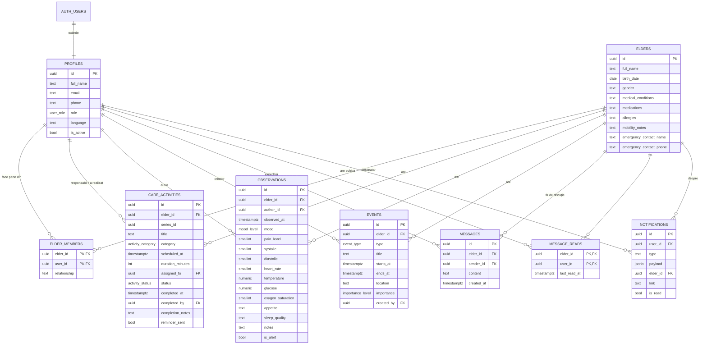

# 3. Baza de date

SGBD: **PostgreSQL** (Supabase). Scripturi: `supabase/migrations/001`–`004`, combinate (fără cron) în `supabase/setup.sql`.

## 3.1 Diagrama entitate–relație

## 3.2 Tipuri enumerate

| Tip | Valori |
|---|---|
| `user_role` | admin, caregiver, family |
| `activity_category` | medication, hygiene, nutrition, mobility, medical, social, other |
| `activity_status` | planned, done, missed, cancelled |
| `event_type` | appointment, visit, incident, fall, hospitalization, medication_change, other |
| `importance_level` | low, normal, high, critical |
| `mood_level` | very_good, good, neutral, bad, very_bad |

## 3.3 Tabele

| Tabel | Rol | Observații de proiectare |
|---|---|---|
| `profiles` | Datele utilizatorului (1:1 cu `auth.users`) | creat automat la înregistrare; `role` și `is_active` protejate de trigger |
| `elders` | Persoanele asistate | profilul medical ca text liber — suficient pentru îngrijire, ușor de completat |
| `elder_members` | Echipa de îngrijire (N:M utilizatori ↔ persoane) | cheie primară compusă; baza tuturor verificărilor de acces |
| `care_activities` | Plan + evidență într-un singur tabel: fiecare rând este o apariție | `series_id` grupează aparițiile unei activități recurente; statusul și câmpurile `completed_*` formează evidența |
| `observations` | Jurnalul de stare și semne vitale | constrângeri `CHECK` pe intervale plauzibile; `is_alert` calculat de trigger |
| `events` | **Baza de date a evenimentelor** | tip + importanță determină dacă evenimentul este „important" (notificare urgentă) |
| `messages` | Conversația echipei, câte un fir per persoană | lungime 1–4000 caractere |
| `message_reads` | Ultima citire a fiecărui fir, per utilizator | calculul mesajelor necitite |
| `notifications` | Căsuța de notificări a fiecărui utilizator | `type` + `payload` JSON; textul este compus în client, în limba destinatarului |

**Indecși:** pe `(elder_id, scheduled_at)`, `(assigned_to, scheduled_at)`, index parțial pe activitățile `planned` (pentru procesarea scadențelor), `(elder_id, observed_at desc)`, `(elder_id, starts_at)`, `(elder_id, created_at desc)` pentru mesaje, `(user_id, created_at desc)` și index parțial pe notificările necitite.

## 3.4 Funcții

| Funcție | Tip | Scop |
|---|---|---|
| `app_role()`, `is_admin()`, `is_staff()` | SECURITY DEFINER, STABLE | rolul utilizatorului curent (doar pentru conturi active) |
| `has_elder_access(elder)` | SECURITY DEFINER | administrator sau membru activ al echipei |
| `shares_elder_with(user)` | SECURITY DEFINER | doi utilizatori au o persoană în comun (pentru vizibilitatea profilurilor) |
| `observation_flags(obs)` | IMMUTABLE | lista valorilor anormale (vezi 3.6) |
| `notify_members(...)` | internă (EXECUTE revocat) | inserează notificări pentru echipa unei persoane, cu filtru pe rol și excluderea autorului |
| `process_due_activities()` | RPC | mementouri la 30 min + marcarea activităților ratate |
| `unread_message_counts()` | RPC | mesaje necitite pe fiecare fir |

## 3.5 Triggere

| Trigger | Eveniment | Efect |
|---|---|---|
| `on_auth_user_created` | INSERT `auth.users` | creează profilul; primul utilizator devine administrator; rolul cerut este limitat la `family` / `caregiver` |
| `profiles_protect_fields` | BEFORE UPDATE `profiles` | doar administratorul modifică `role` / `is_active`; emailul nu poate fi schimbat din profil |
| `observations_before_write` | BEFORE INSERT/UPDATE `observations` | setează `is_alert` dacă există valori anormale |
| `observations_after_insert` | AFTER INSERT | notificare `health_alert` către echipă |
| `events_after_insert` | AFTER INSERT `events` | `important_event` (incident, cădere, spitalizare sau importanță high/critical) sau `new_event` |
| `messages_after_insert` | AFTER INSERT `messages` | `new_message`, **grupată**: un singur rând necitit per fir, cu contor |
| `activities_after_insert` | AFTER INSERT, la nivel de instrucțiune (`REFERENCING NEW TABLE`) | `activity_assigned` — o singură notificare pentru o serie recurentă întreagă |
| `activities_before_update` | BEFORE UPDATE | completează `completed_at/by` la „realizat", le golește la redeschidere; resetează mementoul la reprogramare |
| `activities_after_update` | AFTER UPDATE | reasignare → `activity_assigned`; realizat → `activity_done` către familie; ratat → `activity_missed` către echipă |

## 3.6 Praguri pentru alerte

Definite în `observation_flags()` și oglindite în `src/lib/vitals.ts` (un test automat verifică sincronizarea):

| Semnal | Condiție |
|---|---|
| durere puternică | durere ≥ 7 |
| tensiune mare | sistolică ≥ 180 sau diastolică ≥ 110 mmHg |
| tensiune mică | sistolică < 90 mmHg |
| puls ridicat / scăzut | > 120 / < 45 bpm |
| febră / hipotermie | ≥ 38 °C / < 35 °C |
| saturație scăzută | SpO₂ < 92 % |
| glicemie mare / hipoglicemie | > 250 / < 70 mg/dL |
| stare foarte proastă | dispoziție „foarte proastă" |

> Pragurile sunt orientative, alese pentru semnalare, nu pentru diagnostic. Pot fi ajustate de personalul medical în ambele fișiere.

## 3.7 Securitate (Row Level Security)

RLS este activat pe **toate** tabelele. Principii:

- **citirea** oricărei date despre o persoană cere `has_elder_access(elder_id)`;
- **scrierea** în plan cere în plus `is_staff()`;
- **autorul** este forțat să fie utilizatorul curent (`author_id = auth.uid()`, `sender_id = auth.uid()`, `created_by = auth.uid()`);
- **notificările** nu au politică de INSERT — pot fi create doar de triggere;
- un cont **dezactivat** pierde imediat accesul (funcțiile de rol verifică `is_active`).

Politicile complete: `supabase/migrations/002_policies.sql`.
